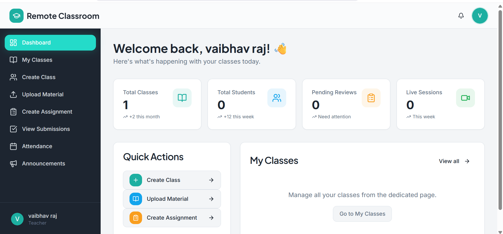
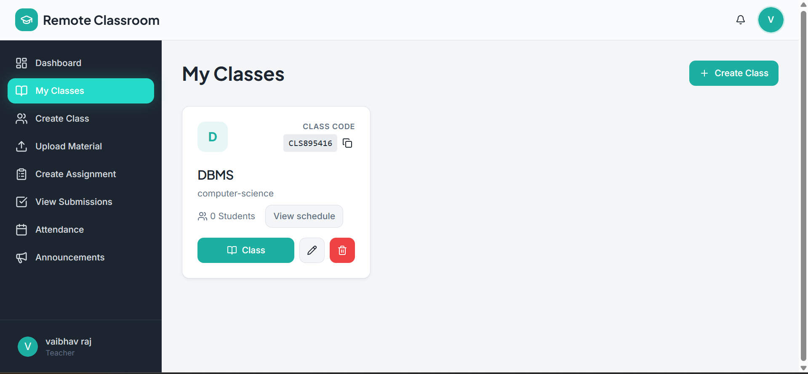
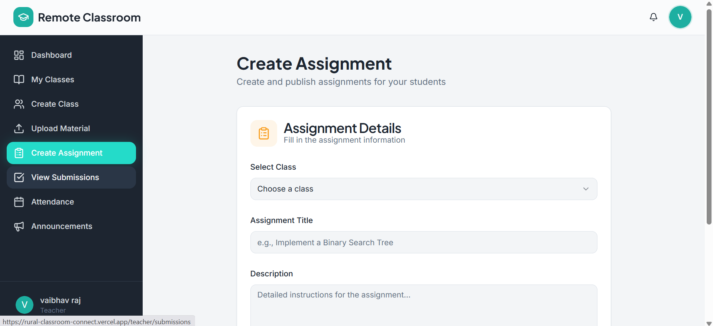
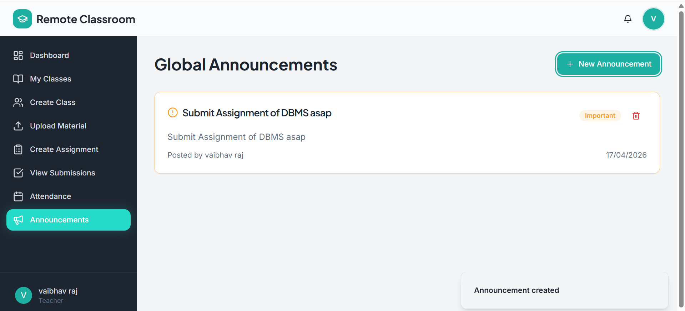
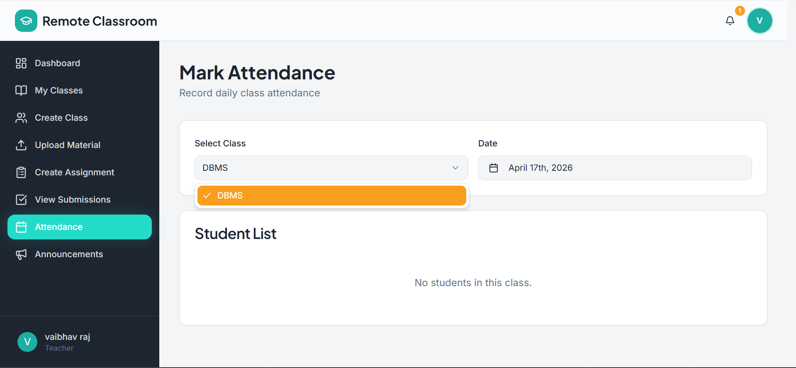
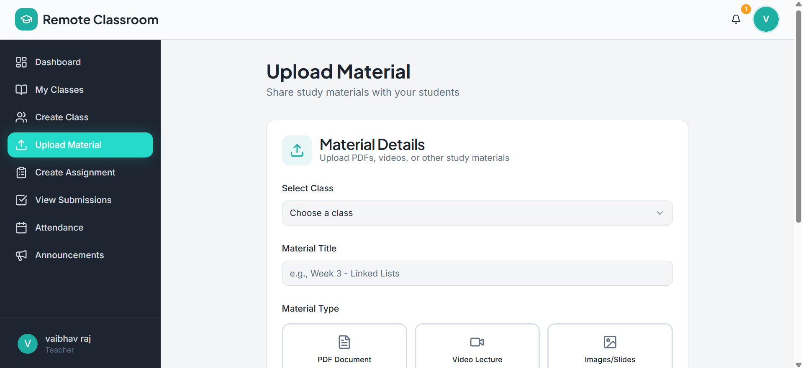

<div align="center">
  
# 🏫 Rural Classroom Connect

A powerful, accessible, and lightweight remote learning platform designed specifically for rural colleges, connecting students and teachers effortlessly.

[](https://reactjs.org/)
[](https://vitejs.dev/)
[](https://tailwindcss.com/)
[](https://nodejs.org/)
[](https://mongodb.com/)

</div>

---

## ✨ Features

**Rural Classroom Connect** brings the complete classroom experience online with a focus on simplicity, speed, and low-bandwidth accessibility:

- 🔐 **Role-based Authentication:** Dedicated flows for **Students** and **Teachers**.
- 📚 **Classroom Management:** Teachers can create classes, manage students, and monitor engagement.
- 📝 **Assignments & Grading:** Seamless assignment creation, submission, and grading workflow.
- 🎯 **Attendance Tracking:** Keep track of student attendance digitally.
- 📢 **Instant Announcements:** Real-time push notifications and feed for class-wide updates.
- 📁 **Study Materials:** Attach and organize course resources securely.
- 🎨 **Modern, Responsive UI:** Beautifully crafted with TailwindCSS, Lucide Icons, and Radix UI primitives.

---

## 📸 Screenshots

| Dashboard | Classes | Assignments |
| :---: | :---: | :---: |
|  |  |  |
| **Announcements** | **Attendance** | **Study Materials** |
|  |  |  |

*(Replace placeholder image URLs with actual project screenshots)*

---

## 🏗️ Project Structure

The project is built as a highly decoupled MERN application:

```text
rural-classroom-connect/
├── backend/                  # Node.js + Express backend
│   ├── config/               # Database and environment configurations
│   ├── controllers/          # API endpoint logic (Auth, Classes, etc.)
│   ├── middleware/           # JWT auth and file upload middleware
│   ├── models/               # Mongoose database schemas
│   ├── routes/               # API route definitions
│   └── server.js             # Main backend application entry point
│
├── src/                      # React frontend
│   ├── api/                  # Axios API clients for backend integration
│   ├── components/           # Reusable UI components (Radix + Tailwind)
│   ├── contexts/             # Global state (Auth Context)
│   └── pages/                # Application views (Login, Dashboards, Class details)
│
├── public/                   # Static assets
└── vite.config.js            # Vite configuration & proxy settings
```

---

## 🚀 Getting Started

### Prerequisites
- [Node.js](https://nodejs.org/) (v18+ recommended)
- [MongoDB Atlas](https://www.mongodb.com/cloud/atlas) Account

### 1. Backend Setup
1. Open the `backend` directory:
   ```bash
   cd backend
   npm install
   ```
2. Copy the `.env.example` file to create your `.env`:
   ```bash
   cp .env.example .env
   ```
3. Update the `MONGO_URI` in `backend/.env` with your MongoDB Atlas connection string.
4. Start the backend development server:
   ```bash
   npm run dev
   ```

### 2. Frontend Setup
1. Open a new terminal in the project root:
   ```bash
   npm install
   ```
2. Start the Vite development server:
   ```bash
   npm run dev
   ```
3. Open your browser to `http://localhost:5173`.

---

## 🌍 Deployment

### Deploy Backend to Render
1. Create a New Web Service pointing to your GitHub repository.
2. Set the Root Directory to `backend`.
3. Build Command: `npm install`
4. Start Command: `npm start`
5. Add `MONGO_URI` in the Environment Variables tab.

### Deploy Frontend to Vercel
1. Create a New Project pointing to your repository.
2. Under Environment Variables, add `VITE_API_BASE` and set it to your new Render backend URL (e.g. `https://your-backend.onrender.com/api`).
3. Deploy!

*(Note: If your frontend is hosted on a custom domain, ensure it is added to the `allowedOrigins` array in `backend/server.js` for CORS)*

---

<div align="center">
  Crafted with ❤️ for modern rural education.
</div>
